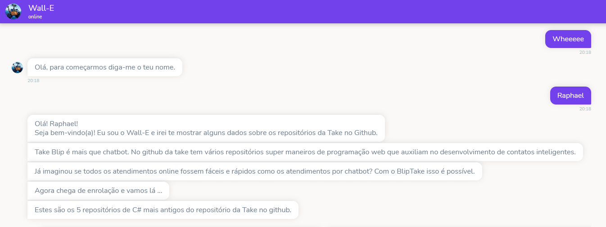
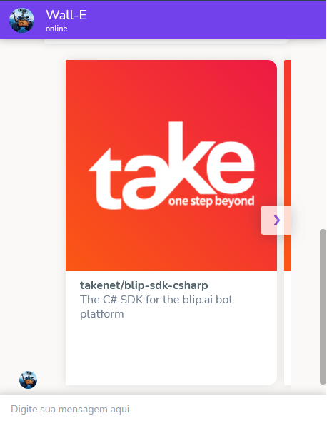

# TakeBot

API criada para o processo seletivo da Take. Essa API coleta dados do github da take e envia para um chatbot do blip. Os dados coletados são os 5 repositórios de linguagem C# mais antigos da Take e ordenados de forma crescente por data de criação. O chatbot do blip exibe os dados desses 5 repositórios em um carrossel.

Esta API foi criada através do Node e utiliza o framework Express. Utilizei o modelo MVC para estruturar o projeto. A API foi publicada no Heroku.

## API
[Link Heroku](https://bot-walle.herokuapp.com/) - https://bot-walle.herokuapp.com/

## Bot Blip
[Link Blip](https://chat.blip.ai/?appKey=d2FsbGU5OmRjMjM1NmExLTRjMzMtNDlhMC05ZDA3LTIzNGE5YWY0MzcyNQ==)

## Imagens do bot

